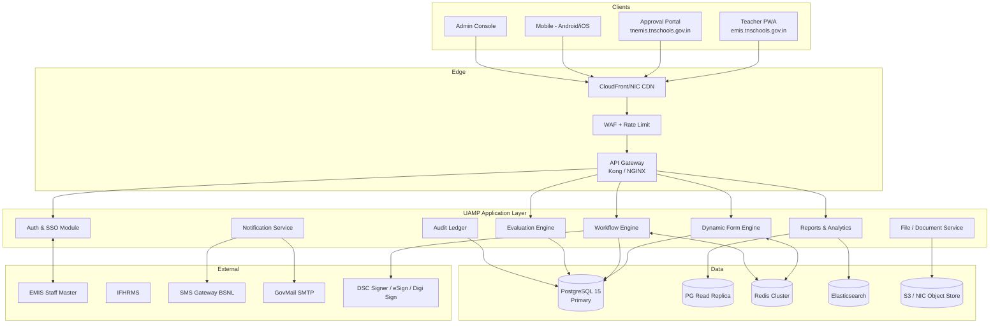
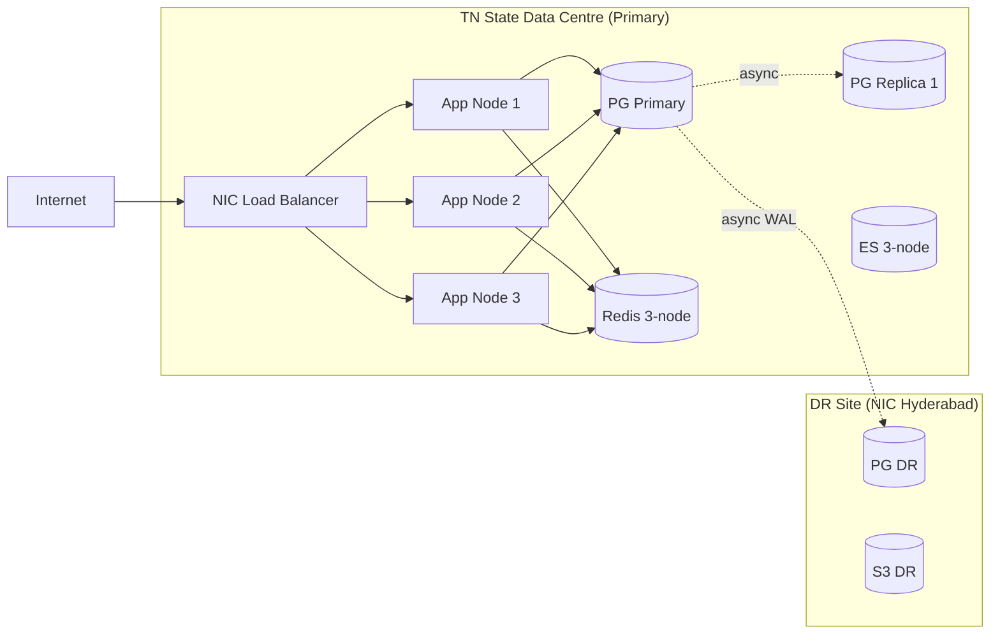
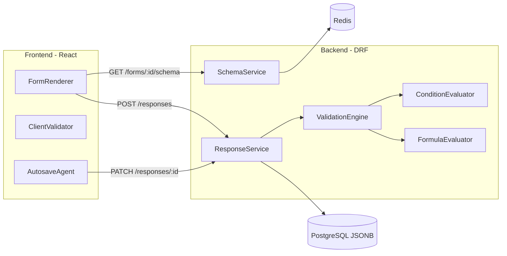
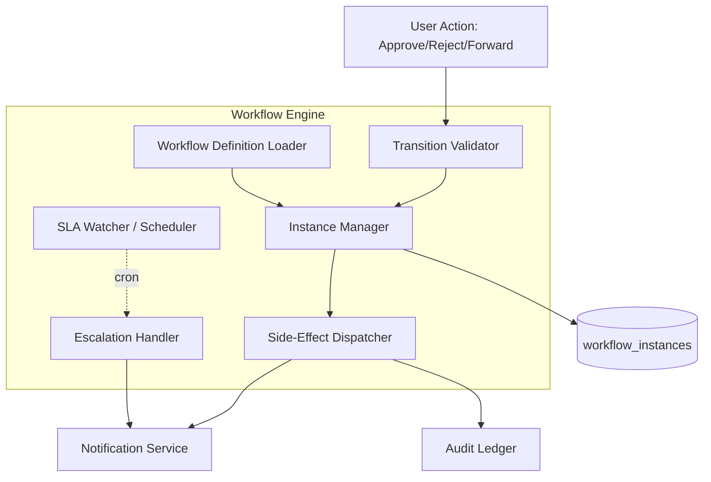
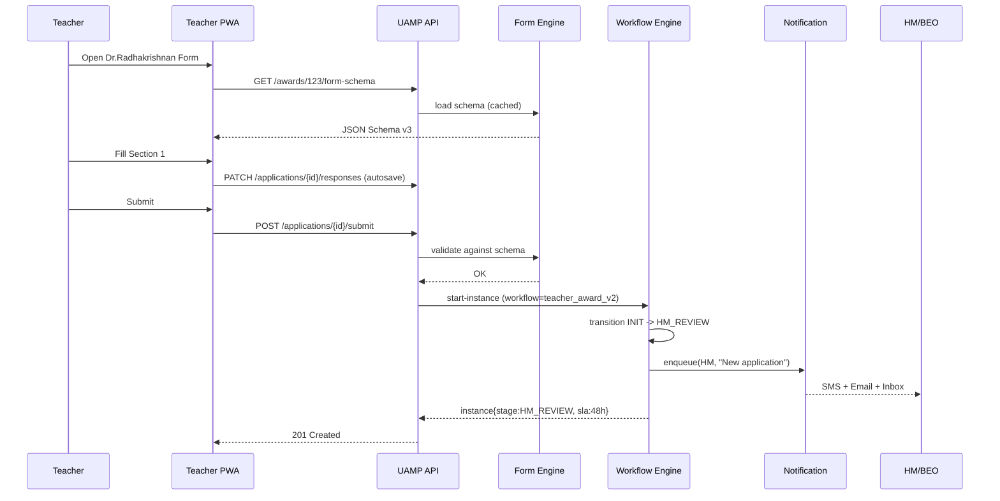
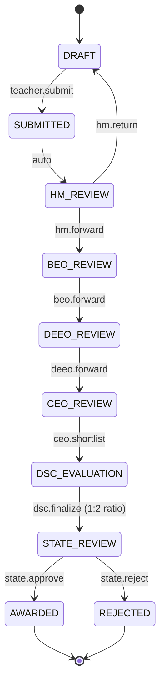
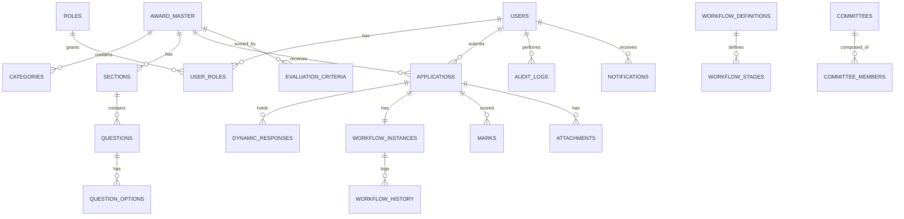
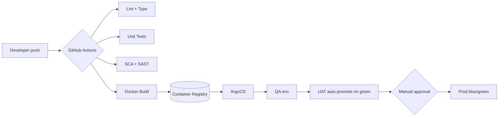

# TNEMIS Unified Award Management Platform (UAMP)
## System Design Document (SDD) + Product Requirements Document (PRD)

**Project Codename:** TNEMIS-UAMP (Unified Award Management Platform)
**Version:** 1.0
**Date:** May 2026
**Prepared for:** School Education Department, Government of Tamil Nadu
**Classification:** Internal — NIC / TNEMIS Engineering
**Authoring Authority:** Office of the Director, TNEMIS

---

## Table of Contents

1. Executive Summary
2. High-Level Architecture
3. Low-Level Architecture
4. Dynamic Form Engine
5. Workflow Engine
6. Database Schema (ERD + DDL)
7. REST API Design
8. Admin Panel Module Catalog
9. Role-Based Access Control (RBAC) Matrix
10. UI/UX Specifications
11. Reports & Analytics
12. Security & Compliance
13. Technology Stack
14. DevOps & Deployment
15. Phased Implementation Plan
16. Risk Register & Mitigation
17. Appendices

---

# 1. Executive Summary

## 1.1 Background

The Dr. Radhakrishnan Award is the apex State-level recognition conferred by the Government of Tamil Nadu on outstanding teachers. The current digital implementation on TNEMIS (`emis.tnschools.gov.in/staff/dr-radhakrishnan-award` and `tnemis.tnschools.gov.in/approval/dr-radha-krishnan-form-ceoapproval`) is a **single-purpose, hardcoded application**. Every section — Personal Details, School Details, Teacher's Qualification, Service Record, Objective Criteria, Performance Criteria, Supporting Documents — and every approval stage (Teacher → BEO → DEEO → CEO → DSC → State) is wired in code. Modifying a question, changing a marking scheme, or onboarding a new award scheme (CM's Best Teacher Award, Anna Centenary Award, State Innovation Award, etc.) requires a fresh release cycle.

Tamil Nadu administers **multiple state-level awards** annually across School Education, Higher Education, and Adult Education. Each is re-implemented from scratch on TNEMIS, costing ~6–8 person-months per award, with high regression risk and inconsistent UX.

## 1.2 Vision

> **"One platform. Every award. Zero code changes."**

Build the **TNEMIS Unified Award Management Platform (UAMP)** — a metadata-driven, workflow-configurable enterprise platform on which any current or future TN Government award scheme can be **launched in days, not months**, entirely through an admin console, with no engineering involvement for routine changes.

## 1.3 Strategic Goals

| # | Goal | Measurable Outcome |
|---|------|--------------------|
| G1 | Eliminate hardcoded forms | 100% of award forms defined via JSON schema in DB |
| G2 | Configurable approval workflows | Workflow Builder UI; zero code for new approval chains |
| G3 | Reusability across award schemes | ≥ 5 award schemes hosted on UAMP within 18 months |
| G4 | Bilingual, accessible, mobile-first | WCAG 2.1 AA; Tamil + English parity; PWA |
| G5 | Auditability & legal defensibility | Every state change logged immutably (append-only ledger) |
| G6 | Scale to 4 lakh+ teachers, 38 districts | p95 API latency ≤ 400 ms at 5k RPS |
| G7 | Fair, transparent evaluation | Configurable rubrics; double-blind committee scoring; ratio enforcement |

## 1.4 Target Users

- **~4,12,000** government & aided school teachers (applicants)
- **~12,500** Headmasters / HMs (verifiers)
- **~385** BEOs, **~110** DEEOs (Secondary + Elementary), **38** CEOs
- **~190** DSC members (CEO Chairperson + DIET Principal + DEOs per district)
- **~25** State Selection Team reviewers
- **~12** State / Technical / Super Admins

## 1.5 Success Metrics (Year 1)

| KPI | Baseline (Today) | Target (Y1) |
|---|---|---|
| Time to launch new award scheme | 6–8 person-months | ≤ 10 working days |
| Application form configuration time | Code release | ≤ 2 hours by admin |
| Avg. teacher submission time | 90 min | 35 min |
| Approval cycle (district level) | 45 days | 18 days |
| Manual evaluation errors | ~8% rework | < 1% |
| System availability | 99.0% | 99.9% |
| Support tickets per cycle | ~6,000 | ≤ 1,500 |

## 1.6 Non-Goals

- Replacement of the broader EMIS Staff master (UAMP integrates, does not replace).
- Replacement of TN Pay/IFHRMS.
- Public-facing nominations from non-EMIS sources (Phase 2+).

---

# 2. High-Level Architecture

## 2.1 Architectural Style

**Modular Monolith, microservice-ready, API-first.**

We deliberately start as a modular monolith for two reasons: (a) NIC-grade deployments in TN data centres favour a small operational footprint, and (b) module boundaries are not yet stable. Each module exposes a versioned internal contract so that any module can be lifted into its own service when traffic or team boundaries demand it.

## 2.2 Logical View



## 2.3 Deployment View (Production)



## 2.4 Core Modules and Responsibilities

| Module | Responsibility | Owns Data |
|---|---|---|
| Auth & SSO | EMIS-SSO integration, JWT issuance, session, MFA | `users`, `sessions`, `roles` |
| Dynamic Form Engine | Schema CRUD, rendering contract, validation, autosave | `award_master`, `sections`, `questions`, `question_options`, `dynamic_responses` |
| Workflow Engine | Stage progression, transitions, SLA, escalations | `workflow_definitions`, `workflow_stages`, `workflow_instances`, `workflow_history` |
| Evaluation Engine | Rubrics, marks, committee scoring, ratio (1:2) enforcement | `evaluation_criteria`, `marks`, `selection_lists` |
| File Service | Pre-signed S3 uploads, AV scan, thumbnailing | `attachments` |
| Notification Service | SMS / Email / In-app fan-out, templated, multilingual | `notifications`, `templates` |
| Reports & Analytics | KPIs, heatmaps, exports (PDF/XLSX/CSV) | Read replica + ES |
| Audit Ledger | Append-only state log, signed Merkle chain | `audit_logs` |
| Admin Console | All meta-configuration UIs | (operates on all of the above) |

---

# 3. Low-Level Architecture

## 3.1 Component Diagram — Dynamic Form Engine



## 3.2 Component Diagram — Workflow Engine



## 3.3 Sequence — Teacher Submission End-to-End



---

# 4. Dynamic Form Engine

## 4.1 Design Principles

1. **Schema-as-data, not schema-as-code.** Every field, label (EN/TA), validation, conditional, and formula lives in PostgreSQL as JSONB. Releases are decoupled from form changes.
2. **Versioned, immutable schemas.** A submitted application is bound to the schema version it saw; later edits to the form do not retroactively invalidate responses.
3. **Composable.** A schema is a tree of `Award → Categories → Sections → Questions → Options`. Repeaters and groups are first-class.
4. **Bilingual by construction.** Every label, hint, error, and option carries `{en, ta}`.
5. **Computable.** Formula fields (e.g., total service years) and conditional visibility are evaluated by a sandboxed expression engine — never `eval`.

## 4.2 JSON Schema — Master Form Definition

```json
{
  "schema_version": "1.0",
  "form_id": "dr_radhakrishnan_award_2026",
  "form_version": 3,
  "title": { "en": "Dr. Radhakrishnan Award Application", "ta": "டாக்டர். ராதாகிருஷ்ணன் விருது விண்ணப்பம்" },
  "applies_to": ["TEACHER", "HM"],
  "categories": [
    {
      "id": "school_teacher",
      "title": { "en": "School Teacher", "ta": "பள்ளி ஆசிரியர்" },
      "eligibility_expr": "user.designation in ['BT','PG','SGT','PST'] && user.service_years >= 15"
    }
  ],
  "sections": [
    {
      "id": "personal_details",
      "order": 1,
      "title": { "en": "Personal Details", "ta": "தனிநபர் விவரங்கள்" },
      "icon": "user",
      "lockable": true,
      "questions": [
        {
          "id": "full_name",
          "type": "text",
          "label": { "en": "Full Name", "ta": "முழுப் பெயர்" },
          "required": true,
          "max_length": 120,
          "prefill_from": "emis.staff.full_name",
          "editable": false
        },
        {
          "id": "dob",
          "type": "date",
          "label": { "en": "Date of Birth", "ta": "பிறந்த தேதி" },
          "required": true,
          "validation": { "max": "today-21y", "min": "today-65y" }
        },
        {
          "id": "gender",
          "type": "radio",
          "options_ref": "GENDER_LOOKUP",
          "required": true
        }
      ]
    },
    {
      "id": "service_record",
      "order": 4,
      "title": { "en": "Service Record", "ta": "பணி பதிவு" },
      "questions": [
        {
          "id": "postings",
          "type": "repeater",
          "label": { "en": "Postings", "ta": "பணியிட விவரங்கள்" },
          "min_rows": 1,
          "max_rows": 20,
          "row_schema": [
            { "id": "school", "type": "lookup", "source": "emis.schools", "required": true },
            { "id": "from_date", "type": "date", "required": true },
            { "id": "to_date", "type": "date", "required": false, "nullable_label": { "en": "Till date", "ta": "இன்று வரை" } },
            { "id": "designation", "type": "select", "options_ref": "DESIG_LOOKUP" }
          ]
        },
        {
          "id": "total_service_years",
          "type": "formula",
          "label": { "en": "Total Service (Years)", "ta": "மொத்த சேவை (ஆண்டுகள்)" },
          "formula": "SUM_YEARS(postings[*].from_date, postings[*].to_date)",
          "readonly": true,
          "min": 15
        }
      ]
    },
    {
      "id": "objective_criteria",
      "order": 5,
      "title": { "en": "Objective Criteria", "ta": "புறநிலை அளவுகோல்கள்" },
      "questions": [
        {
          "id": "result_class10_pct",
          "type": "number",
          "label": { "en": "Class X Result %", "ta": "10ஆம் வகுப்பு முடிவு %" },
          "min": 0, "max": 100, "decimals": 2,
          "marks_band": [
            { "lte": 50, "marks": 0 },
            { "lte": 75, "marks": 4 },
            { "lte": 90, "marks": 7 },
            { "gt": 90, "marks": 10 }
          ]
        }
      ]
    },
    {
      "id": "supporting_documents",
      "order": 7,
      "title": { "en": "Supporting Documents", "ta": "ஆதரவு ஆவணங்கள்" },
      "questions": [
        {
          "id": "service_certificate",
          "type": "file",
          "required": true,
          "accept": ["application/pdf"],
          "max_size_mb": 5,
          "av_scan": true,
          "visible_if": "total_service_years >= 15"
        }
      ]
    }
  ],
  "rules": [
    {
      "id": "lock_section_on_submit",
      "when": "section.submitted == true",
      "then": "section.editable = false"
    }
  ]
}
```

## 4.3 Supported Field Types

| Type | Purpose | Notes |
|---|---|---|
| `text`, `textarea` | Free text | regex, min/max len |
| `number`, `decimal` | Numeric | min, max, step |
| `date`, `datetime`, `daterange` | Dates | `today-Ny` tokens supported |
| `radio`, `checkbox`, `select`, `multiselect` | Choice | options inline or `options_ref` |
| `lookup` | Dynamic source | `emis.schools`, `emis.designation`, etc. |
| `file` | Upload | accept, max size, AV scan flag |
| `formula` | Computed | sandboxed expression |
| `repeater` | 1..N rows | `row_schema` |
| `group` | Logical grouping | nested questions |
| `signature` | Drawn / eSign | DSC integration optional |
| `geo` | Lat/long | for school visit verification |
| `richtext` | Markdown subset | for narrative answers |

## 4.4 Conditional Logic & Formulas

A small **JSON-LogicX** dialect is supported. Functions are whitelisted; arbitrary JS is impossible.

```json
{
  "visible_if": { ">=": [ { "var": "total_service_years" }, 15 ] },
  "required_if": { "==": [ { "var": "category" }, "school_teacher" ] }
}
```

Allowed functions: arithmetic (`+ - * / %`), comparison (`== != > < >= <=`), logical (`and or not`), `IN`, `LEN`, `SUM`, `SUM_YEARS`, `DATE_DIFF`, `IF`, `COALESCE`, `NORMALIZE`.

## 4.5 Validation Engine

Two-layer validation:

- **Client-side** (React): instant feedback, mirrors schema, optimistic.
- **Server-side** (DRF): canonical, authoritative. Runs at autosave (warn) and at submit (block).

```python
# Pseudocode
def validate(response, schema):
    errors = []
    for section in schema.sections:
        if not section.is_visible(response): continue
        for q in section.questions:
            v = response.get(q.id)
            errors += run_validators(q, v, response)
    return errors
```

## 4.6 Autosave

- Debounced 1.5 s per field; explicit `PATCH /applications/{id}/responses` with JSON Patch (RFC 6902).
- Conflict resolution: last-write-wins per field; full-document version vector in `dynamic_responses.version`.
- Offline buffer in IndexedDB for poor-connectivity districts (Nilgiris, Dharmapuri rural).

---

# 5. Workflow Engine

## 5.1 Concepts

- **Workflow Definition** — a versioned graph of **Stages** and **Transitions**.
- **Workflow Instance** — one application's journey through the graph.
- **Actor** — a `role` + optional `scope` (district, block).
- **Transition** — `from_stage → to_stage` triggered by `action`, gated by `guard`.
- **SLA** — per-stage timer; on breach, **Escalation** rule fires.
- **Committee Stage** — N actors must vote; reducer (`majority`, `unanimous`, `weighted`, `quorum`) decides outcome.

## 5.2 Stage Configuration



## 5.3 Sample Workflow JSON (Dr. Radhakrishnan Award v2)

```json
{
  "workflow_id": "dr_radhakrishnan_v2",
  "version": 2,
  "applies_to_award": "dr_radhakrishnan_award_2026",
  "start_stage": "DRAFT",
  "stages": [
    {
      "id": "DRAFT",
      "type": "user",
      "actor_role": "TEACHER",
      "sla_hours": null
    },
    {
      "id": "HM_REVIEW",
      "type": "single_approver",
      "actor_role": "HM",
      "actor_scope": "applicant.school_id",
      "sla_hours": 48,
      "on_breach": "escalate_to:BEO"
    },
    {
      "id": "BEO_REVIEW",
      "type": "single_approver",
      "actor_role": "BEO",
      "actor_scope": "applicant.block_id",
      "sla_hours": 72
    },
    {
      "id": "DEEO_REVIEW",
      "type": "single_approver",
      "actor_role": "DEEO",
      "actor_scope": "applicant.district_id+stream(SEC|ELE)",
      "sla_hours": 120
    },
    {
      "id": "CEO_REVIEW",
      "type": "single_approver",
      "actor_role": "CEO",
      "actor_scope": "applicant.district_id",
      "sla_hours": 168,
      "actions": ["shortlist", "return"]
    },
    {
      "id": "DSC_EVALUATION",
      "type": "committee",
      "committee_id": "DSC",
      "scoring": {
        "rubric_id": "rad_2026_rubric",
        "reducer": "weighted_average",
        "min_voters": 3
      },
      "ratio_enforcement": { "applicants_per_award": 2, "scope": "district" },
      "sla_hours": 240
    },
    {
      "id": "STATE_REVIEW",
      "type": "committee",
      "committee_id": "STATE_TEAM",
      "scoring": { "rubric_id": "rad_2026_state_rubric", "reducer": "majority" },
      "sla_hours": 336
    },
    { "id": "AWARDED", "type": "terminal" },
    { "id": "REJECTED", "type": "terminal" }
  ],
  "transitions": [
    { "from": "DRAFT", "to": "HM_REVIEW", "action": "submit", "actor": "TEACHER",
      "guard": "form.is_complete && form.required_files_present" },
    { "from": "HM_REVIEW", "to": "BEO_REVIEW", "action": "forward", "actor": "HM" },
    { "from": "HM_REVIEW", "to": "DRAFT", "action": "return", "actor": "HM",
      "requires_comment": true },
    { "from": "BEO_REVIEW", "to": "DEEO_REVIEW", "action": "forward", "actor": "BEO" },
    { "from": "DEEO_REVIEW", "to": "CEO_REVIEW", "action": "forward", "actor": "DEEO" },
    { "from": "CEO_REVIEW", "to": "DSC_EVALUATION", "action": "shortlist", "actor": "CEO",
      "guard": "ratio_check(district, 1:2) == true" },
    { "from": "DSC_EVALUATION", "to": "STATE_REVIEW", "action": "finalize", "actor": "DSC_CHAIR",
      "guard": "all_members_voted && shortlist_size == ratio_target" },
    { "from": "STATE_REVIEW", "to": "AWARDED", "action": "approve", "actor": "STATE_ADMIN" },
    { "from": "STATE_REVIEW", "to": "REJECTED", "action": "reject", "actor": "STATE_ADMIN" }
  ],
  "escalations": [
    { "stage": "HM_REVIEW", "after_hours": 48, "notify": "BEO", "auto_action": null },
    { "stage": "BEO_REVIEW", "after_hours": 96, "notify": "DEEO" }
  ]
}
```

## 5.4 Committee Stage Reducer Pseudocode

```python
def reduce_committee(votes, reducer):
    if reducer == "majority":
        return max(set(v.decision for v in votes), key=lambda d: sum(1 for v in votes if v.decision==d))
    if reducer == "weighted_average":
        total = sum(v.score * v.weight for v in votes)
        wsum  = sum(v.weight for v in votes)
        return total / wsum
    if reducer == "unanimous":
        return votes[0].decision if all(v.decision == votes[0].decision for v in votes) else None
```

## 5.5 1:2 Ratio Enforcement

At CEO stage, the system computes per-district shortlist size:

```
shortlist_target = ceil(district_award_quota * 2)
```

If `quota = 3 awards`, CEO must shortlist exactly **6 teachers** to DSC. A guard prevents `shortlist` action until `selected_count == shortlist_target`.

---

# 6. Database Schema

## 6.1 ERD (Logical)



## 6.2 DDL (PostgreSQL 15)

```sql
-- =========================================================
-- IDENTITY & ACCESS
-- =========================================================
CREATE TABLE users (
    user_id           BIGSERIAL PRIMARY KEY,
    emis_id           VARCHAR(20) UNIQUE NOT NULL,
    email             CITEXT UNIQUE,
    mobile            VARCHAR(15),
    full_name         VARCHAR(160) NOT NULL,
    designation       VARCHAR(80),
    district_id       INT,
    block_id          INT,
    school_id         BIGINT,
    is_active         BOOLEAN DEFAULT TRUE,
    created_at        TIMESTAMPTZ DEFAULT now(),
    updated_at        TIMESTAMPTZ DEFAULT now()
);

CREATE TABLE roles (
    role_id           SERIAL PRIMARY KEY,
    code              VARCHAR(40) UNIQUE NOT NULL, -- TEACHER, HM, BEO, DEEO, CEO, DSC_MEMBER, STATE_REVIEWER, STATE_ADMIN, SUPER_ADMIN, TECH_ADMIN
    name_en           VARCHAR(80),
    name_ta           VARCHAR(120),
    description       TEXT
);

CREATE TABLE user_roles (
    user_id           BIGINT REFERENCES users(user_id) ON DELETE CASCADE,
    role_id           INT    REFERENCES roles(role_id),
    scope_type        VARCHAR(20),     -- DISTRICT, BLOCK, SCHOOL, STATE
    scope_id          BIGINT,
    valid_from        DATE DEFAULT CURRENT_DATE,
    valid_to          DATE,
    PRIMARY KEY (user_id, role_id, scope_type, scope_id)
);

-- =========================================================
-- AWARD METADATA
-- =========================================================
CREATE TABLE award_master (
    award_id          BIGSERIAL PRIMARY KEY,
    code              VARCHAR(60) UNIQUE NOT NULL,    -- DR_RADHAKRISHNAN_2026
    name_en           VARCHAR(200) NOT NULL,
    name_ta           VARCHAR(300),
    description_en    TEXT,
    description_ta    TEXT,
    cycle_year        INT NOT NULL,
    status            VARCHAR(20) DEFAULT 'DRAFT', -- DRAFT, OPEN, CLOSED, ARCHIVED
    open_from         TIMESTAMPTZ,
    close_at          TIMESTAMPTZ,
    workflow_id       BIGINT,
    schema_version    INT DEFAULT 1,
    created_by        BIGINT REFERENCES users(user_id),
    created_at        TIMESTAMPTZ DEFAULT now()
);

CREATE TABLE categories (
    category_id       BIGSERIAL PRIMARY KEY,
    award_id          BIGINT REFERENCES award_master(award_id) ON DELETE CASCADE,
    code              VARCHAR(60),
    name_en           VARCHAR(160),
    name_ta           VARCHAR(240),
    eligibility_expr  TEXT,                -- JSON-LogicX
    award_quota       INT,                 -- awards per district per category
    sort_order        INT
);

CREATE TABLE sections (
    section_id        BIGSERIAL PRIMARY KEY,
    award_id          BIGINT REFERENCES award_master(award_id) ON DELETE CASCADE,
    code              VARCHAR(60),
    title_en          VARCHAR(200),
    title_ta          VARCHAR(300),
    sort_order        INT,
    is_lockable       BOOLEAN DEFAULT TRUE,
    visible_if        JSONB
);

CREATE TABLE questions (
    question_id       BIGSERIAL PRIMARY KEY,
    section_id        BIGINT REFERENCES sections(section_id) ON DELETE CASCADE,
    code              VARCHAR(80),
    field_type        VARCHAR(30) NOT NULL, -- text, number, date, radio, file, formula, repeater...
    label_en          VARCHAR(300),
    label_ta          VARCHAR(450),
    is_required       BOOLEAN DEFAULT FALSE,
    validation        JSONB,                -- min/max/regex/etc
    visible_if        JSONB,
    required_if       JSONB,
    formula           TEXT,
    options_ref       VARCHAR(60),          -- lookup code
    marks_band        JSONB,                -- objective criteria mapping
    sort_order        INT,
    UNIQUE (section_id, code)
);

CREATE TABLE question_options (
    option_id         BIGSERIAL PRIMARY KEY,
    question_id       BIGINT REFERENCES questions(question_id) ON DELETE CASCADE,
    value             VARCHAR(80),
    label_en          VARCHAR(200),
    label_ta          VARCHAR(300),
    sort_order        INT
);

-- =========================================================
-- APPLICATIONS & RESPONSES
-- =========================================================
CREATE TABLE applications (
    application_id    BIGSERIAL PRIMARY KEY,
    award_id          BIGINT REFERENCES award_master(award_id),
    applicant_id      BIGINT REFERENCES users(user_id),
    category_id       BIGINT REFERENCES categories(category_id),
    schema_version    INT NOT NULL,
    status            VARCHAR(30) DEFAULT 'DRAFT',
    submitted_at      TIMESTAMPTZ,
    created_at        TIMESTAMPTZ DEFAULT now(),
    UNIQUE (award_id, applicant_id)
);

CREATE TABLE dynamic_responses (
    response_id       BIGSERIAL PRIMARY KEY,
    application_id    BIGINT REFERENCES applications(application_id) ON DELETE CASCADE,
    section_id        BIGINT REFERENCES sections(section_id),
    payload           JSONB NOT NULL,
    is_locked         BOOLEAN DEFAULT FALSE,
    version           INT DEFAULT 1,
    updated_at        TIMESTAMPTZ DEFAULT now(),
    UNIQUE (application_id, section_id)
);
CREATE INDEX idx_dynamic_responses_payload_gin ON dynamic_responses USING GIN (payload jsonb_path_ops);

-- =========================================================
-- WORKFLOW
-- =========================================================
CREATE TABLE workflow_definitions (
    workflow_id       BIGSERIAL PRIMARY KEY,
    code              VARCHAR(60) UNIQUE,
    version           INT,
    definition        JSONB NOT NULL,    -- full graph
    is_active         BOOLEAN DEFAULT TRUE,
    created_at        TIMESTAMPTZ DEFAULT now()
);

CREATE TABLE workflow_stages (
    stage_id          BIGSERIAL PRIMARY KEY,
    workflow_id       BIGINT REFERENCES workflow_definitions(workflow_id),
    code              VARCHAR(40),
    stage_type        VARCHAR(20),       -- user, single_approver, committee, terminal
    actor_role        VARCHAR(40),
    sla_hours         INT,
    config            JSONB
);

CREATE TABLE workflow_instances (
    instance_id       BIGSERIAL PRIMARY KEY,
    application_id    BIGINT UNIQUE REFERENCES applications(application_id),
    workflow_id       BIGINT REFERENCES workflow_definitions(workflow_id),
    current_stage     VARCHAR(40),
    current_actor_id  BIGINT,
    sla_deadline      TIMESTAMPTZ,
    started_at        TIMESTAMPTZ DEFAULT now(),
    closed_at         TIMESTAMPTZ
);

CREATE TABLE workflow_history (
    history_id        BIGSERIAL PRIMARY KEY,
    instance_id       BIGINT REFERENCES workflow_instances(instance_id),
    from_stage        VARCHAR(40),
    to_stage          VARCHAR(40),
    action            VARCHAR(40),
    actor_id          BIGINT REFERENCES users(user_id),
    comment           TEXT,
    metadata          JSONB,
    occurred_at       TIMESTAMPTZ DEFAULT now()
);
CREATE INDEX idx_wfh_instance ON workflow_history(instance_id, occurred_at);

-- =========================================================
-- EVALUATION
-- =========================================================
CREATE TABLE evaluation_criteria (
    criterion_id      BIGSERIAL PRIMARY KEY,
    award_id          BIGINT REFERENCES award_master(award_id),
    rubric_code       VARCHAR(40),
    code              VARCHAR(60),
    name_en           VARCHAR(200),
    name_ta           VARCHAR(300),
    max_marks         NUMERIC(6,2),
    weight            NUMERIC(5,2) DEFAULT 1.0,
    section_ref       BIGINT REFERENCES sections(section_id),
    auto_computed     BOOLEAN DEFAULT FALSE,
    formula           TEXT
);

CREATE TABLE marks (
    marks_id          BIGSERIAL PRIMARY KEY,
    application_id    BIGINT REFERENCES applications(application_id),
    criterion_id      BIGINT REFERENCES evaluation_criteria(criterion_id),
    evaluator_id      BIGINT REFERENCES users(user_id),
    score             NUMERIC(6,2),
    remarks           TEXT,
    scored_at         TIMESTAMPTZ DEFAULT now(),
    UNIQUE (application_id, criterion_id, evaluator_id)
);

CREATE TABLE committees (
    committee_id      BIGSERIAL PRIMARY KEY,
    code              VARCHAR(40),       -- DSC, STATE_TEAM
    award_id          BIGINT REFERENCES award_master(award_id),
    scope_type        VARCHAR(20),       -- DISTRICT, STATE
    scope_id          BIGINT,
    name_en           VARCHAR(200),
    name_ta           VARCHAR(300)
);

CREATE TABLE committee_members (
    committee_member_id BIGSERIAL PRIMARY KEY,
    committee_id      BIGINT REFERENCES committees(committee_id) ON DELETE CASCADE,
    user_id           BIGINT REFERENCES users(user_id),
    role_in_committee VARCHAR(40),       -- CHAIR, MEMBER, MEMBER_SECRETARY
    weight            NUMERIC(4,2) DEFAULT 1.0,
    added_at          TIMESTAMPTZ DEFAULT now()
);

-- =========================================================
-- SUPPORTING
-- =========================================================
CREATE TABLE attachments (
    attachment_id     BIGSERIAL PRIMARY KEY,
    application_id    BIGINT REFERENCES applications(application_id) ON DELETE CASCADE,
    question_code     VARCHAR(80),
    s3_key            VARCHAR(400) NOT NULL,
    file_name         VARCHAR(200),
    mime_type         VARCHAR(80),
    size_bytes        BIGINT,
    checksum_sha256   CHAR(64),
    av_status         VARCHAR(20),       -- PENDING, CLEAN, INFECTED
    uploaded_by       BIGINT REFERENCES users(user_id),
    uploaded_at       TIMESTAMPTZ DEFAULT now()
);

CREATE TABLE notifications (
    notification_id   BIGSERIAL PRIMARY KEY,
    recipient_id      BIGINT REFERENCES users(user_id),
    channel           VARCHAR(10),       -- SMS, EMAIL, INAPP
    template_code     VARCHAR(60),
    payload           JSONB,
    status            VARCHAR(20),       -- QUEUED, SENT, FAILED, READ
    sent_at           TIMESTAMPTZ,
    created_at        TIMESTAMPTZ DEFAULT now()
);

CREATE TABLE audit_logs (
    audit_id          BIGSERIAL PRIMARY KEY,
    actor_id          BIGINT,
    actor_role        VARCHAR(40),
    entity_type       VARCHAR(40),
    entity_id         BIGINT,
    action            VARCHAR(40),
    before_state      JSONB,
    after_state       JSONB,
    ip_address        INET,
    user_agent        VARCHAR(300),
    prev_hash         CHAR(64),
    row_hash          CHAR(64) NOT NULL,  -- SHA-256(prev_hash || canonical_json(row))
    occurred_at       TIMESTAMPTZ DEFAULT now()
);
CREATE INDEX idx_audit_entity ON audit_logs(entity_type, entity_id, occurred_at DESC);
```

## 6.3 Key Design Decisions

- **JSONB for responses** keeps schema migrations cheap; we still index hot paths via GIN.
- **Versioned schemas** — applications bind to `schema_version` so admins can publish v4 without invalidating in-flight v3 submissions.
- **Append-only audit ledger** with Merkle-style `row_hash = SHA256(prev_hash || canonical(row))` makes tampering detectable.
- **`user_roles` carries scope** so the same person can be `BEO@block_42` and `DSC_MEMBER@district_5`.

---

# 7. REST API Design

## 7.1 Conventions

- **Base URL:** `https://api.tnemis.gov.in/uamp/v1/`
- **Versioning:** URI segment (`/v1/`); deprecation header `Sunset:` per RFC 8594.
- **Auth:** `Authorization: Bearer <JWT>` issued by EMIS SSO (OIDC). Refresh tokens rotated every 12 h.
- **Errors:** RFC 7807 Problem Details.
- **Pagination:** `?page=1&page_size=25` and `Link` header.
- **Idempotency:** mutating endpoints accept `Idempotency-Key`.

## 7.2 Endpoint Hierarchy

```
/v1/auth/
    POST /login                  (delegated SSO bounce)
    POST /refresh
    POST /logout

/v1/awards/
    GET    /                     (list)
    POST   /                     (create) [SUPER_ADMIN]
    GET    /{award_id}
    PATCH  /{award_id}
    POST   /{award_id}/publish
    GET    /{award_id}/form-schema?version=

/v1/awards/{award_id}/categories/
/v1/awards/{award_id}/sections/
/v1/sections/{section_id}/questions/

/v1/applications/
    POST   /                     (start application)
    GET    /{id}
    PATCH  /{id}/responses       (autosave, JSON Patch)
    POST   /{id}/submit
    POST   /{id}/attachments     (returns S3 pre-signed PUT URL)

/v1/workflow/
    GET    /instances/{id}
    POST   /instances/{id}/transition
    GET    /inboxes/me

/v1/evaluation/
    GET    /applications/{id}/rubric
    POST   /applications/{id}/marks
    GET    /committees/{id}/shortlist

/v1/admin/
    /awards/builder
    /workflows/                  (CRUD workflow definitions)
    /lookups/                    (manage GENDER_LOOKUP, DESIG_LOOKUP, ...)
    /committees/

/v1/reports/
    GET /awards/{id}/dashboard
    GET /awards/{id}/exports/xlsx

/v1/audit/
    GET /logs?entity=application&id=
```

## 7.3 Sample — Submit an Application

```http
POST /v1/applications/9012345/submit HTTP/1.1
Authorization: Bearer eyJhbGciOi...
Idempotency-Key: 2026-05-14-app9012345-submit
Content-Type: application/json

{}
```

```http
HTTP/1.1 201 Created
Content-Type: application/json

{
  "application_id": 9012345,
  "status": "SUBMITTED",
  "workflow_instance": {
    "instance_id": 778899,
    "current_stage": "HM_REVIEW",
    "sla_deadline": "2026-05-16T14:30:00+05:30"
  },
  "submitted_at": "2026-05-14T14:30:00+05:30"
}
```

## 7.4 Sample — Workflow Transition

```http
POST /v1/workflow/instances/778899/transition
{
  "action": "shortlist",
  "comment": "Strong service record; recommended for DSC.",
  "metadata": { "shortlist_rank": 4 }
}
```

```http
200 OK
{
  "instance_id": 778899,
  "from_stage": "CEO_REVIEW",
  "to_stage": "DSC_EVALUATION",
  "actor": { "user_id": 4421, "role": "CEO", "district": "Coimbatore" },
  "occurred_at": "2026-05-14T14:32:11+05:30"
}
```

## 7.5 Sample — Error (RFC 7807)

```json
{
  "type": "https://api.tnemis.gov.in/errors/validation",
  "title": "Schema validation failed",
  "status": 422,
  "instance": "/v1/applications/9012345/submit",
  "errors": [
    { "question_code": "service_certificate", "message_en": "File is required", "message_ta": "கோப்பு தேவை" }
  ]
}
```

---

# 8. Admin Panel Module Catalog

| Module | Screens |
|---|---|
| **Award Management** | Award list · Create/Edit Award · Cycle settings · Publish/Archive · Clone from previous cycle |
| **Category Management** | Category list per award · Eligibility expression builder · Quota matrix (district × category) |
| **Section Builder** | Drag-drop ordering · Visibility rules · Lock policy · Bilingual labels |
| **Question Builder** | Field type palette · Validation builder · Marks-band editor · Formula editor with live preview · Conditional logic builder |
| **Lookup Manager** | GENDER, DESIGNATION, SUBJECT, AWARD_LIST, etc. · Bilingual options · Import CSV |
| **Workflow Builder** | Visual stage graph (React Flow) · Transition rules · SLA & escalation · Committee binding |
| **Evaluation Config** | Rubric editor · Weights · Auto-computed criteria · Reducer selection |
| **Committee Config** | Committee list · Member assignment with scope · Role-in-committee · Weights |
| **User & Role Admin** | User search · Role assignment with scope · Delegation · Deactivation |
| **Notification Templates** | EN/TA templates · Channel routing · Test send |
| **Reports & Exports** | Builder · Saved reports · Schedule · Export formats |
| **Audit Explorer** | Search audit ledger · Verify chain integrity · Export evidence pack |
| **System Health** | Job queues · SLA breach monitor · Integration health |
| **Feature Flags** | Per-district / per-award toggles |

---

# 9. RBAC Matrix

Legend: **C**reate · **R**ead · **U**pdate · **D**elete · **A**pprove · **S**core · **N** = none

| Capability | Teacher | HM | BEO | DEEO | CEO | DSC Member | State Reviewer | State Admin | Super Admin | Tech Admin |
|---|---|---|---|---|---|---|---|---|---|---|
| Apply to award | C, R own | N | N | N | N | N | N | N | N | N |
| View own application | R | R (school) | R (block) | R (district) | R (district) | R (district shortlist) | R (state) | R (all) | R (all) | R (all) |
| Forward / Return | N | A | A | A | A | N | N | N | N | N |
| Shortlist (1:2) | N | N | N | N | A | N | N | N | N | N |
| Score (rubric) | N | N | N | N | N | S | S | N | N | N |
| Finalize district shortlist | N | N | N | N | N | A (chair) | N | N | N | N |
| Approve award | N | N | N | N | N | N | A (recommend) | A (final) | N | N |
| Create award scheme | N | N | N | N | N | N | N | C | C | N |
| Edit form schema | N | N | N | N | N | N | N | U | U | N |
| Edit workflow | N | N | N | N | N | N | N | U | U | N |
| Manage users / roles | N | N | N | N | N | N | N | N | CRUD | R |
| Manage committees | N | N | N | N | R | R | N | CRUD | CRUD | N |
| View audit logs | R own | R school | R block | R district | R district | R district | R state | R all | R all | R all |
| Feature flags / DevOps | N | N | N | N | N | N | N | N | R | CRUD |
| Impersonate (break-glass) | N | N | N | N | N | N | N | N | N | A (logged) |

**Enforcement:** Casbin-style policy (`subject, scope, action, resource`) evaluated at API gateway *and* re-checked at service layer.

---

# 10. UI/UX Specifications

## 10.1 Design Tokens

| Surface | Primary | Accent | Background | Text |
|---|---|---|---|---|
| Teacher / Staff Portal | `#E91E63` (TN-Pink) | `#C2185B` | `#FFF8FA` | `#212121` |
| Admin / Approval Portal | `#1A237E` (TN-Blue) | `#3F51B5` | `#F5F7FB` | `#1B1B1F` |
| Success / Warning / Danger | `#2E7D32` / `#F9A825` / `#C62828` | — | — | — |

Typography: **Noto Sans Tamil + Inter**, base 14px, scale 1.25.
Spacing: 4-pt grid. Radius: 8px. Elevation: 4-level Material-style.
Accessibility: WCAG 2.1 AA, focus rings, ARIA, keyboard nav, 4.5:1 contrast minimum.

## 10.2 Teacher Portal (Stepper Form)

```
+---------------------------------------------------------------+
| TNEMIS  | Dr.Radhakrishnan Award Application          [JS ▼]  |
+---------------------------------------------------------------+
| [1] Personal  >  [2] School  >  [3] Qualification  >  [4]...  |
+---------------------------------------------------------------+
|  Personal Details / தனிநபர் விவரங்கள்                            |
|  ┌────────────────────────┐  ┌────────────────────────┐       |
|  │ Full Name *            │  │ EMIS ID (locked)       │       |
|  └────────────────────────┘  └────────────────────────┘       |
|  ...                                                          |
|  💾 Autosaved 14:02   ⓘ All sections lock on submit            |
|  [ Save Draft ]    [ Next ▶ ]                                  |
+---------------------------------------------------------------+
| Timeline:  ✅ Draft  ◯ HM  ◯ BEO  ◯ DEEO  ◯ CEO  ◯ DSC  ◯ State |
+---------------------------------------------------------------+
```

- **Stepper** with progress, jumpable to completed sections.
- **Autosave indicator** (last saved Xs ago).
- **Bilingual toggle** persistent per user.
- **Timeline tracker** at the bottom on every page (sticky on desktop, collapsible on mobile).
- **Mobile-first**: stepper collapses to accordion; PWA with offline draft cache.

## 10.3 CEO Dashboard

```
+---------------------------------------------------------------+
| TN EMIS — Coimbatore CEO                          BALAMURALI R |
+---------------------------------------------------------------+
| District Quota: 3 awards   Required shortlist (1:2): 6        |
| ┌─────────────┬──────────────┬───────────────┬──────────────┐ |
| │ Received    │ Pending CEO  │ Shortlisted   │ SLA Breached │ |
| │   142       │    47        │    4 / 6      │     2        │ |
| └─────────────┴──────────────┴───────────────┴──────────────┘ |
| [ All ] [ Pending ] [ Shortlisted ] [ Returned ]              |
| ┌──────────────────────────────────────────────────────────┐  |
| │ EMIS ID  Name              School    Score  SLA  Action  │  |
| │ 10017826 JEYASANTHI J      GHS Ukka. 86.5   ✓    [View] │  |
| │ 10021145 RAVIKUMAR R       GHSS Pol. 84.0   ⚠    [View] │  |
| └──────────────────────────────────────────────────────────┘  |
| [ Bulk Forward ]  [ Generate DSC Pack ]                       |
+---------------------------------------------------------------+
```

## 10.4 DSC Evaluation Screen

- Side-by-side: applicant dossier (left), rubric scoring (right).
- Each criterion shows max marks, prior auto-score (objective), space for manual score + remarks.
- **Double-blind toggle** hides applicant names from individual scorers until reducer finalizes.
- **eSign** the final shortlist sheet (DSC Approval Certificate generation).

## 10.5 Dynamic Form Builder (Admin)

- Three-pane: **Palette** (field types) · **Canvas** (drag-and-drop tree) · **Inspector** (selected node properties).
- Live JSON preview & "Render-as-teacher" preview.
- Schema diff viewer between versions.

## 10.6 Workflow Monitor

- React-Flow visual graph; nodes shaded by current load and SLA health.
- Click a node → list of in-flight instances at that stage.
- Heatmap overlay by district.

---

# 11. Reports & Analytics

## 11.1 Standard Reports

| Report | Audience | Filters | Formats |
|---|---|---|---|
| District Submission Funnel | CEO, State | award, district, date | XLSX, PDF |
| SLA Compliance Report | State Admin | stage, district, period | XLSX, PDF |
| Shortlist Composite Score Report | DSC, State | award, district | PDF (signed) |
| Award Winners List | Public-facing | year, award | PDF |
| Evaluator Activity Log | State Admin | evaluator, period | XLSX |
| Audit Evidence Pack | Tech Admin, Legal | entity, period | ZIP (PDF+JSON+hash) |
| Bilingual Acknowledgement Letter | Teacher | own application | PDF |
| Demographic Equity Report | State | gender, category, district | XLSX, dashboard |

## 11.2 Dashboard KPIs

- Applications received / day, by district.
- Stage-wise WIP and median dwell time.
- SLA breach %, MTTR by stage.
- Top 10 districts by submission velocity.
- **District Heatmap** (TN choropleth) — submissions, completion %, shortlist composition.

## 11.3 Export Pipeline

- Reports built on **read replica + Elasticsearch** for free-text searches across narrative answers.
- Scheduled exports via Celery Beat; large exports streamed to S3 with signed link expiring in 24h.

---

# 12. Security & Compliance

| Area | Control |
|---|---|
| **AuthN** | OIDC via EMIS SSO; JWT (RS256); 15-min access + 12-h refresh; MFA mandatory for `STATE_*`, `*_ADMIN` roles |
| **AuthZ** | Casbin RBAC + scope; deny-by-default; double check at gateway and service |
| **Transport** | TLS 1.3 only; HSTS preload; mTLS between services |
| **Data at rest** | PostgreSQL TDE; S3 SSE-KMS; per-tenant KMS key for sensitive PII |
| **Attachments** | ClamAV scan on upload; quarantine bucket; deny serving until CLEAN |
| **Audit** | Append-only `audit_logs` with Merkle-chained `row_hash`; daily snapshot signed and pushed to WORM bucket |
| **IP logging** | Every mutating call records source IP + UA; geo flagged if outside India |
| **Rate limiting** | Per-IP and per-user; submit endpoints stricter |
| **Data retention** | Application data: 10 years (RTI defensibility); audit: 15 years; PII purge workflow on user request post-retention |
| **PII minimization** | Phone/email masked in non-privileged views |
| **Backups** | PG: PITR with 35-day WAL; nightly logical dumps; S3 versioning + lifecycle |
| **Pen-test** | Annual CERT-In empanelled; quarterly internal |
| **Compliance** | DPDP Act 2023 alignment; aligns with NIC Guidelines for Web Apps; OWASP ASVS L2 |
| **Break-glass** | Tech-admin impersonation requires dual-approval; logged with elevated retention |

---

# 13. Technology Stack

| Layer | Choice | Rationale |
|---|---|---|
| Frontend | **React 18 + TypeScript + Vite**, TanStack Query, Zustand, React Hook Form, React Flow, Tailwind, shadcn/ui, i18next | Modern, well-known to NIC partners, strong form & graph libs |
| Mobile | **PWA** (Workbox) initially; React Native if native required in Phase 4 | Reuses web codebase |
| API | **Django 5 + DRF + Pydantic v2** | Mature, batteries-included, strong for govt projects |
| Auth | **Authlib** + EMIS OIDC; Casbin for RBAC | |
| Workflow | **Custom engine** (deterministic, JSON-defined) — evaluated Camunda/Temporal but custom is simpler and ownable | |
| DB | **PostgreSQL 15** (JSONB heavy), partitioned for `applications`, `audit_logs` | |
| Cache / Queue | **Redis 7** (cache) + **Celery + Redis broker** | |
| Search | **Elasticsearch 8** | Tamil analyzer, narrative search |
| Object store | **AWS S3** (or NIC MeghRaj S3-compatible) | |
| Observability | **OpenTelemetry → Grafana + Tempo + Loki + Prometheus** | |
| CI/CD | **GitHub Actions / GitLab CI → ArgoCD → Kubernetes (EKS / MeghRaj)** | |
| Container | **Docker + Kubernetes** | |
| IaC | **Terraform** | |
| Secrets | **HashiCorp Vault** | |

---

# 14. DevOps & Deployment

## 14.1 Environments

`dev` → `qa` → `uat (with masked prod data)` → `staging` → `prod` → `dr`

## 14.2 CI/CD



- **Branching:** trunk-based; short-lived feature branches; release tags `vX.Y.Z`.
- **Migrations:** `django-pg-migrate` with zero-downtime contract (additive only, then cleanup).
- **Feature flags:** Unleash.

## 14.3 Backup & DR

- **RPO:** 5 min (WAL streaming).
- **RTO:** 60 min.
- **DR drill:** quarterly; documented runbooks.
- **S3 cross-region replication** to DR site.

## 14.4 Observability SLOs

| SLO | Target |
|---|---|
| API availability | 99.9% monthly |
| p95 read latency | ≤ 300 ms |
| p95 write latency | ≤ 600 ms |
| Notification delivery (SMS) | ≥ 98% in 5 min |
| File upload success | ≥ 99% |

---

# 15. Phased Implementation Plan

**Total estimated effort:** ~88 person-months across 5 phases, 14 calendar months.

## Phase 1 — Foundations (Months 1–3, ~18 PM)

- Auth/SSO with EMIS, RBAC skeleton.
- Core data model (users, roles, awards, sections, questions, applications, responses).
- Skeleton Dynamic Form Engine (text, number, date, radio, file types).
- Admin: Award + Section + Question builders (basic).
- Teacher portal: stepper render + autosave.
- **Exit criteria:** A simple award (3 sections) can be configured end-to-end, with a teacher submitting and an HM viewing.

## Phase 2 — Workflow & Approvals (Months 3–6, ~22 PM)

- Workflow Engine v1 (linear + single-approver stages).
- BEO, DEEO, CEO inboxes.
- Notification Service (SMS + Email + In-app).
- Audit ledger v1.
- Reports v1 (funnel, SLA).
- **Exit criteria:** Dr. Radhakrishnan flow runs end-to-end up to CEO shortlist for a pilot district.

## Phase 3 — Evaluation & Committee (Months 6–9, ~18 PM)

- Committee stages, double-blind scoring.
- Rubric + marks engine.
- 1:2 ratio enforcement.
- DSC Approval Certificate generation + eSign.
- State Review stage.
- **Exit criteria:** Full Dr. Radhakrishnan cycle for 1–2 pilot districts (Coimbatore, Madurai).

## Phase 4 — Advanced Forms & Configurability (Months 9–11, ~12 PM)

- Repeaters, formulas, conditional logic, lookups.
- Visual Workflow Builder.
- Lookup Manager.
- Bilingual hardening, accessibility audit.
- **Exit criteria:** Onboard a second award (CM's Best Teacher Award) with **zero code changes**.

## Phase 5 — Scale, Analytics, Hardening (Months 11–14, ~18 PM)

- Elasticsearch-backed search & reporting.
- District heatmap, advanced dashboards.
- DR drill, load testing (5k RPS).
- CERT-In pen-test, remediation.
- Statewide rollout — all 38 districts.
- **Exit criteria:** Production at full scale, 99.9% SLO met for two consecutive months.

## 15.1 Team Structure

| Pod | Composition |
|---|---|
| Platform Core | 1 TL + 3 Sr. + 3 Mid backend + 1 DBA |
| Frontend | 1 TL + 4 React engineers |
| QA | 1 Lead + 3 SDETs |
| DevOps / SRE | 1 Lead + 2 engineers |
| UX | 1 Lead + 1 designer + 1 researcher |
| Product / PM | 1 Product Head + 2 PMs |
| Security | 1 Lead (shared with NIC) |
| **Total** | ~25 FTE |

---

# 16. Risk Register & Mitigation

| # | Risk | Likelihood | Impact | Mitigation |
|---|------|---|---|---|
| R1 | EMIS SSO integration delays | M | H | Stub OIDC IdP in dev/UAT; contractual SLA with EMIS team; fallback username/password for pilot |
| R2 | Schema migration breaking in-flight applications | M | H | Versioned schemas; applications bound to their version; never mutate past versions |
| R3 | Concurrency conflicts in autosave | M | M | JSON Patch + per-section version vector; last-write-wins per field with merge UI on conflict |
| R4 | File upload abuse / virus | M | H | Pre-signed URL + size cap + ClamAV + quarantine bucket |
| R5 | DSC scoring bias / lack of transparency | M | H | Double-blind scoring; signed certificate; full audit ledger; per-scorer activity report |
| R6 | Peak-load failure at submission deadline | H | H | Deadline traffic shaping; queue-based submit; horizontal autoscale; 2× pre-provisioned capacity at T-7 days |
| R7 | Vendor lock-in (AWS) | L | M | S3-compatible API; abstract storage layer; deploy on MeghRaj possible |
| R8 | Workflow misconfiguration in prod | M | H | "Workflow Sandbox" preview; dry-run validation; staged publish with rollback |
| R9 | Tamil rendering / font issues on legacy browsers | L | M | Noto Sans Tamil shipped; IE deprecation policy; min-browser banner |
| R10 | Data exfiltration via report exports | M | H | Watermark exports with viewer EMIS ID + timestamp; rate-limit; alert on bulk export |
| R11 | RBAC drift over time | M | M | Quarterly access review; auto-deactivation on inactivity > 180 days |
| R12 | Legal challenge to award decision | L | H | Tamper-evident ledger; signed certificates; complete evidence pack export |

---

# 17. Appendices

## 17.1 Glossary

- **UAMP** — Unified Award Management Platform
- **DSC** — District Selection Committee
- **CEO** — Chief Educational Officer (district)
- **DEEO** — District Educational Officer (Secondary / Elementary)
- **BEO** — Block Educational Officer
- **HM** — Headmaster / Headmistress
- **DIET** — District Institute of Education & Training
- **EMIS** — Educational Management Information System
- **SDD** — System Design Document
- **PRD** — Product Requirements Document

## 17.2 Sample Lookup JSON

```json
{
  "code": "DESIG_LOOKUP",
  "items": [
    { "value": "BT",  "label_en": "B.T. Assistant",     "label_ta": "பி.டி. உதவியாளர்" },
    { "value": "PG",  "label_en": "P.G. Assistant",     "label_ta": "பி.ஜி. உதவியாளர்" },
    { "value": "SGT", "label_en": "Secondary Grade Teacher", "label_ta": "இரண்டாம் நிலை ஆசிரியர்" },
    { "value": "PST", "label_en": "Primary School Teacher",  "label_ta": "தொடக்கப் பள்ளி ஆசிரியர்" },
    { "value": "HM",  "label_en": "Headmaster/Headmistress", "label_ta": "தலைமையாசிரியர்" }
  ]
}
```

## 17.3 Sample Audit Log Entry

```json
{
  "audit_id": 88123412,
  "actor_id": 4421,
  "actor_role": "CEO",
  "entity_type": "application",
  "entity_id": 9012345,
  "action": "shortlist",
  "before_state": { "status": "CEO_REVIEW" },
  "after_state":  { "status": "DSC_EVALUATION", "shortlist_rank": 4 },
  "ip_address": "10.14.22.51",
  "user_agent": "Mozilla/5.0 ...",
  "prev_hash": "a7f3...c01b",
  "row_hash":  "9d12...4e8a",
  "occurred_at": "2026-05-14T14:32:11+05:30"
}
```

## 17.4 Open Questions for Stakeholders

1. Confirm legal retention period for application data — currently assumed 10 years.
2. Confirm whether eSign integration is via NIC eSign or DSC USB tokens for DSC members.
3. Final list of award schemes to migrate in Year 1 (target: Dr.Radhakrishnan + CM's Best Teacher + Anna Centenary).
4. Confirm whether MeghRaj (NIC Cloud) or AWS is the production target.
5. Should public-facing nominations (citizen / SMC) be in Phase 5 scope?

---

**— End of Document —**

*Prepared by the TNEMIS Engineering Office. For revisions, raise an MR against `tnemis/uamp-docs` or email `tnemis-architecture@tnschools.gov.in`.*
